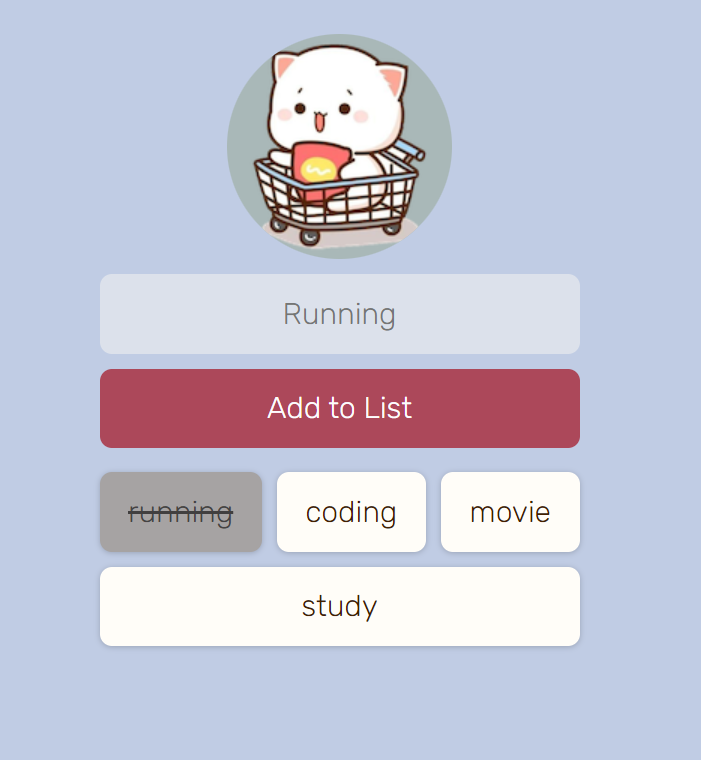

# Todo App

This is a simple todo list application built with HTML, CSS, JavaScript, and Firebase.

## Features

- Add, edit, and delete tasks.
- Mark tasks as completed.
- Real-time synchronization of tasks using Firebase Firestore.
- Simple and intuitive user interface.



## Technologies Used

- **Frontend:**
  - HTML - For building the structure of the application.
  - CSS - For styling the user interface.
  - JavaScript - For implementing the application logic and interaction.

- **Backend:**
  - Firebase Firestore - NoSQL cloud database for storing todo items.

## Setup Instructions

1. **Clone the repository:**

   ```bash
   git clone https://github.com/TheValour/Mobo.git
   ```

2. **Set up Firebase:**
   
   - Create a new project on [Firebase Console](https://console.firebase.google.com/).
   - Enable Firestore database..
   - Obtain your Firebase configuration object.

3. **Deploy the application:**

   If you're hosting the app on Firebase Hosting or any other hosting service, deploy the app.

## Usage

1. **Open the app:**

   Open the `index.html` file in your browser to access the todo app.

2. **Add tasks:**

   - Type the task in the input field.
   - Press Enter or click the "Add" button to add the task.

3. **Mark tasks as completed:**

   - Click on the task to mark it as completed.

4. **Edit or delete tasks:**

   - double Click on the task to delete a task.

## Contributing

Contributions are welcomed and encouraged! Feel free to join us in enhancing this todo app together.

> [TheValour](https://github.com/TheValour) : Developer 🧑‍💻

